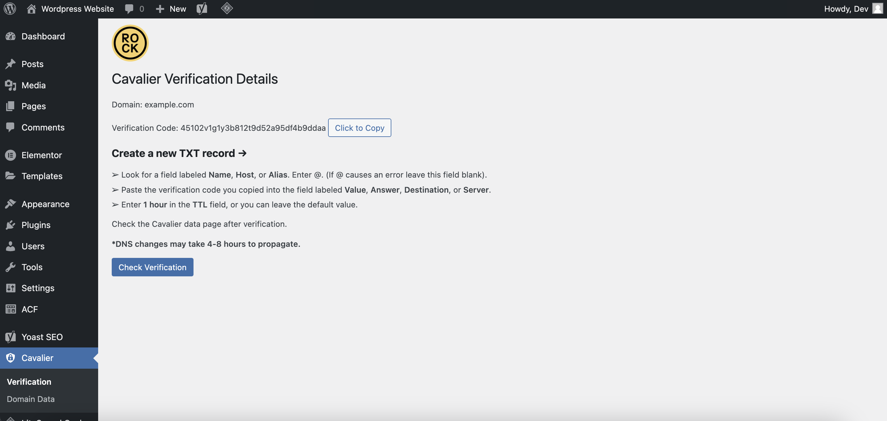
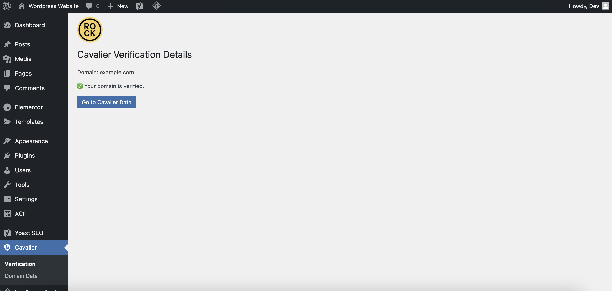
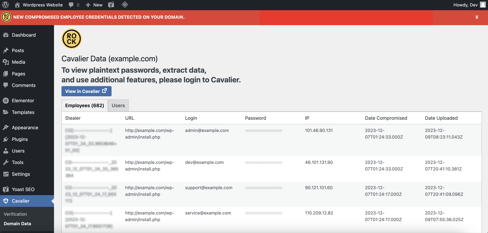

=== Cavalier by Hudson Rock ===
Contributors: hudsonrock
Tags: security, monitoring, cybersecurity, threatintelligence
Requires at least: 5.0
Tested up to: 6.4.2
Stable tag: 1.0
License: GPLv2 or later
License URI: https://www.gnu.org/licenses/gpl-2.0.html

== Description ==

Cavalier by Hudson Rock is a powerful security plugin that provides seamless integration between your WordPress website and the Cavalier Web App at [https://cavalier.hudsonrock.com](https://cavalier.hudsonrock.com). Monitor your website's domain for new compromised employees and users, receive email notifications, and display relevant data in your WordPress admin dashboard.

Main Features:

- Full access to the Cavalier Web App at [https://cavalier.hudsonrock.com](https://cavalier.hudsonrock.com)
- Monitor your website's domain for new compromised employees and users.
- Receive email notifications for new compromised employees and users.
- Integration with WordPress to display your website's domain compromised employees and users in your WP admin dashboard.

== Installation ==

1. Upload the `cavalier-by-hudson-rock` folder to the `/wp-content/plugins/` directory.
2. Activate the plugin through the 'Plugins' menu in WordPress.
3. Configure the plugin settings by visiting the 'Cavalier' section in your WordPress admin panel.

== Frequently Asked Questions ==

= How do I configure the plugin settings? =

After activation, go to your WordPress admin dashboard and navigate to the 'Cavalier' section. Verify your domain with a simple DNS TXT record and then head over the Cavalier data page after verification.

= Do I need a Cavalier account to use this plugin? =

No, Once your domain is verified, a Cavalier account will be opened for you automatically along with a one-click login link that will appear on the plugin page.

= Where do these results come from? =

Every credential presented in Cavalier was stolen directly from the browsers of victims who had a stealer type malware executed on their machine. These malwares are spread by tricking a victim to download a malicious file through various methods. The attacks are usually performed by threat actors in global opportunistic campaigns, with little discretion, so employees in companies that aren't even targeted often have their corporate credentials stolen.

= How does Hudson Rock obtain this information? =

Hudson Rock acquires and purchases compromised information directly from top-tier threat actors and closed-circle hacking groups. What sets this information apart is its low availability in other high-fidelity threat intelligence companies and its high accessibility to hacker groups looking for potential targets. Our operational knowhow and our boots-on-the-ground approach to cybercrime come from the IDF's 8200 Cybercrime division and its efforts to thwart nation-state adversaries and professional threat actors.

= How do we differentiate between compromised employees and compromised clients? =

Hudson Rock uses different logics to differentiate between compromised employees and compromised clients. Credentials containing an email address of a company (i.e., @Tesla.com) that are used to access a Tesla.com domain most likely belong to an employee of that company, while a @gmail.com email address accessing the same domain is likely a client. Additional logic is used to differentiate employees from clients - the type of technologies in the domain that the compromised credentials accessed may indicate that they belong to an employee, for example: The username “john” signing into citrix.tesla.com / tesla.com/vpn/login / webmail.tesla.com.

= How is Cavalier different than other threat intelligence platforms? =

Many cybercrime intelligence platforms aggregate data from publicly available database leaks, whereas Hudson Rock does not pursue generally available credentials as its main goal. Publicly available databases enable finding old or unrelated credentials by the same user, leaving the hacker to check if they were reused in other, more sensitive services that they’re trying to access. We consider this information to be less valuable, for several reasons:

1. Time - stolen credentials are usually published (for free) after hackers think the leads are not very valuable. This is usually AFTER the actionable threats occurred. Hudson Rock integrates data from compromised computers merely days after they were compromised, and at the same time they are obtained by sophisticated threat actors attempting to perform data breaches and ransomware attacks.

2. Relevancy to clients - data from info-stealers is the most prominent attack vector used by sophisticated hacking groups to obtain initial access to company servers or to overtake end-user accounts, the data is unrivaled because hackers are able to bypass traditional security measures such as 2-factor authentication by injecting cookies from the compromised computers or finding the backup codes for revoking the 2-factor authentication stored on the compromised computer.

3. Password reuse dependency - While password reuse is an issue, employees don't tend to reuse passwords to critical infrastructure across different services and end-users don’t always reuse passwords across all services they use. The passwords originating from leaked databases are not remotely as impactful as passwords stolen from the browsers of the victims where there is a direct link between the domain they browsed into and their emails and plaintext passwords. This is because when a victim has had a stealer executed on their machine, all the domains, emails, usernames, and passwords they have ever used are captured.

= How can we prevent such attacks? =

In order to avoid having a machine in your organization compromised by these global malware campaigns, it is advised to adhere to basic security guidelines such as:

- Enforcing file download restrictions on machine devices to prevent the download of malware.
- Force a password change every 6 months, apply safe length and complexity requirements on passwords.

It's important to note that even if all internal computers are secure, employees can often access company resources through third-party computers, which might be compromised.

Hudson Rock recommends revoking all the compromised credentials immediately to prevent further access to your network by potential hackers with access to these credentials. As long as these credentials remain active, they can be used to access the organization's network to deploy ransomware attacks, information breaches, corporate espionage, and other intrusions. We advise alerting the employee to the breach and ask them to reset all personal credentials as well. After revoking the compromised credentials, organizations should investigate the usage of these credentials to see if they were used maliciously, and if persistent access was acquired by using them. In the case of compromised clients' credentials, we advise resetting the passwords of said clients and issuing an email explaining to them that steps to boost their security were taken place.

== Screenshots ==

1. 
   Screenshot of the domain verification instructions in the WordPress admin panel.

2. 
   Screenshot of the domain verified in the WordPress admin panel.

3. 
   Screenshot of the domain data in the WordPress admin panel.

== Changelog ==

= 1.0 =

- Initial release.

== Upgrade Notice ==

= 1.0 =
This is the initial release of the Cavalier by Hudson Rock plugin.

== License ==

This plugin is released under the GPLv2 or later license. You can find a copy of the license at [https://www.gnu.org/licenses/gpl-2.0.html](https://www.gnu.org/licenses/gpl-2.0.html).

== Acknowledgments ==

- Special thanks to the development team at Hudson Rock for making this integration possible.
